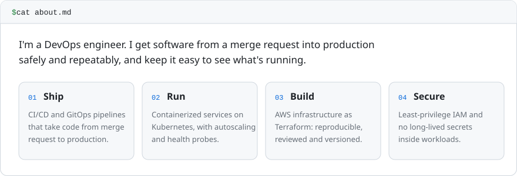
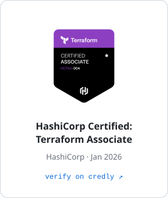
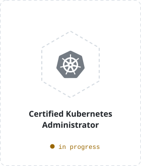
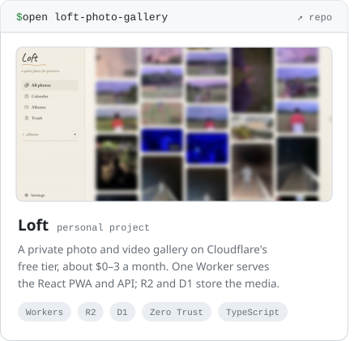

<picture>
  <source media="(prefers-color-scheme: dark)" srcset="assets/header-dark.svg">
  
</picture>

<picture>
  <source media="(prefers-color-scheme: dark)" srcset="assets/about-dark.svg">
  
</picture>

<picture>
  <source media="(prefers-color-scheme: dark)" srcset="assets/pipeline-dark.svg">
  
</picture>

<picture>
  <source media="(prefers-color-scheme: dark)" srcset="assets/toolbox-dark.svg">
  
</picture>

<a href="https://www.credly.com/badges/bdd0eda1-411b-4cd4-a2b6-10155483f8cf"><picture>
  <source media="(prefers-color-scheme: dark)" srcset="assets/cert-aws-dark.svg">
  
</picture></a>
<a href="https://www.credly.com/badges/fff54a45-392c-44fd-9e08-bd745c8e09a3"><picture>
  <source media="(prefers-color-scheme: dark)" srcset="assets/cert-terraform-dark.svg">
  
</picture></a>
<picture>
  <source media="(prefers-color-scheme: dark)" srcset="assets/cert-cka-dark.svg">
  
</picture>

<a href="https://github.com/muhsinjifri/loft-photo-gallery"><picture>
  <source media="(prefers-color-scheme: dark)" srcset="assets/project-loft-dark.svg">
  
</picture></a>
<picture>
  <source media="(prefers-color-scheme: dark)" srcset="assets/project-rag-dark.svg">
  
</picture>

<a href="https://www.linkedin.com/in/muhsinjifri"><picture>
  <source media="(prefers-color-scheme: dark)" srcset="assets/btn-linkedin-dark.svg">
  
</picture></a>
&nbsp;
<a href="mailto:muhsinjifri@gmail.com"><picture>
  <source media="(prefers-color-scheme: dark)" srcset="assets/btn-email-dark.svg">
  
</picture></a>

